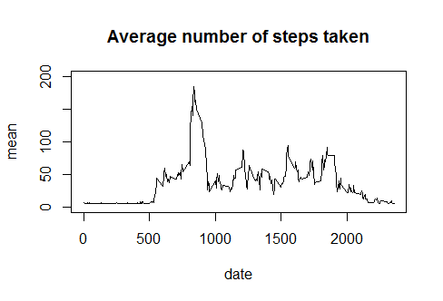
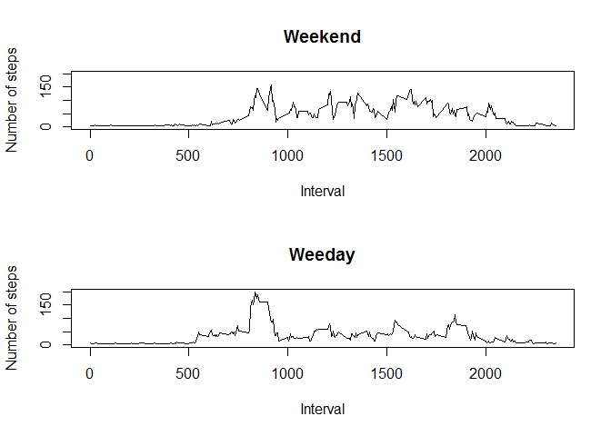

Dataset: Activity moninotoring data

Variables: ·steps: Number of steps taking in a 5-minute interval
(missing values are coded as NA)

·date: The date on which the measurement was taken in YYYY-MM-DD format

·interval: Identifier for the 5-minute interval in which measurement was
taken

1. Code for reading in the dataset and/or processing the data
-------------------------------------------------------------

    setwd("D:/")
    data<-read.csv("activity.csv" )
    head(data)

    ##   steps       date interval
    ## 1    NA 2012-10-01        0
    ## 2    NA 2012-10-01        5
    ## 3    NA 2012-10-01       10
    ## 4    NA 2012-10-01       15
    ## 5    NA 2012-10-01       20
    ## 6    NA 2012-10-01       25

Structure data

    str(data)

    ## 'data.frame':    17568 obs. of  3 variables:
    ##  $ steps   : int  NA NA NA NA NA NA NA NA NA NA ...
    ##  $ date    : Factor w/ 61 levels "2012-10-01","2012-10-02",..: 1 1 1 1 1 1 1 1 1 1 ...
    ##  $ interval: int  0 5 10 15 20 25 30 35 40 45 ...

    summary(data)

    ##      steps                date          interval     
    ##  Min.   :  0.00   2012-10-01:  288   Min.   :   0.0  
    ##  1st Qu.:  0.00   2012-10-02:  288   1st Qu.: 588.8  
    ##  Median :  0.00   2012-10-03:  288   Median :1177.5  
    ##  Mean   : 37.38   2012-10-04:  288   Mean   :1177.5  
    ##  3rd Qu.: 12.00   2012-10-05:  288   3rd Qu.:1766.2  
    ##  Max.   :806.00   2012-10-06:  288   Max.   :2355.0  
    ##  NA's   :2304     (Other)   :15840

Transform variable date

    data$date<-as.Date(as.character(data$date),format="%Y-%m-%d")

2. Histogram of the total number of steps taken each day
--------------------------------------------------------

    stepsByDay<-data.frame(sapply(split(data$steps,data$date),sum))
    hist(stepsByDay[,1],xlab="Number of step",main="Histogram of the total number of steps taken each day")

3. Mean and median number of steps taken each day
-------------------------------------------------

    meanStepsByDay<-data.frame(sapply(split(data$steps,data$date),mean))
    colnames(meanStepsByDay)<-"meanStepsByDay"
    meanStepsByDay

    ##            meanStepsByDay
    ## 2012-10-01             NA
    ## 2012-10-02      0.4375000
    ## 2012-10-03     39.4166667
    ## 2012-10-04     42.0694444
    ## 2012-10-05     46.1597222
    ## 2012-10-06     53.5416667
    ## 2012-10-07     38.2465278
    ## 2012-10-08             NA
    ## 2012-10-09     44.4826389
    ## 2012-10-10     34.3750000
    ## 2012-10-11     35.7777778
    ## 2012-10-12     60.3541667
    ## 2012-10-13     43.1458333
    ## 2012-10-14     52.4236111
    ## 2012-10-15     35.2048611
    ## 2012-10-16     52.3750000
    ## 2012-10-17     46.7083333
    ## 2012-10-18     34.9166667
    ## 2012-10-19     41.0729167
    ## 2012-10-20     36.0937500
    ## 2012-10-21     30.6284722
    ## 2012-10-22     46.7361111
    ## 2012-10-23     30.9652778
    ## 2012-10-24     29.0104167
    ## 2012-10-25      8.6527778
    ## 2012-10-26     23.5347222
    ## 2012-10-27     35.1354167
    ## 2012-10-28     39.7847222
    ## 2012-10-29     17.4236111
    ## 2012-10-30     34.0937500
    ## 2012-10-31     53.5208333
    ## 2012-11-01             NA
    ## 2012-11-02     36.8055556
    ## 2012-11-03     36.7048611
    ## 2012-11-04             NA
    ## 2012-11-05     36.2465278
    ## 2012-11-06     28.9375000
    ## 2012-11-07     44.7326389
    ## 2012-11-08     11.1770833
    ## 2012-11-09             NA
    ## 2012-11-10             NA
    ## 2012-11-11     43.7777778
    ## 2012-11-12     37.3784722
    ## 2012-11-13     25.4722222
    ## 2012-11-14             NA
    ## 2012-11-15      0.1423611
    ## 2012-11-16     18.8923611
    ## 2012-11-17     49.7881944
    ## 2012-11-18     52.4652778
    ## 2012-11-19     30.6979167
    ## 2012-11-20     15.5277778
    ## 2012-11-21     44.3993056
    ## 2012-11-22     70.9270833
    ## 2012-11-23     73.5902778
    ## 2012-11-24     50.2708333
    ## 2012-11-25     41.0902778
    ## 2012-11-26     38.7569444
    ## 2012-11-27     47.3819444
    ## 2012-11-28     35.3576389
    ## 2012-11-29     24.4687500
    ## 2012-11-30             NA

    medianStepsByDay<-data.frame(sapply(split(data$steps,data$date),median))
    colnames(medianStepsByDay)<-"medianStepsByDay"
    medianStepsByDay

    ##            medianStepsByDay
    ## 2012-10-01               NA
    ## 2012-10-02                0
    ## 2012-10-03                0
    ## 2012-10-04                0
    ## 2012-10-05                0
    ## 2012-10-06                0
    ## 2012-10-07                0
    ## 2012-10-08               NA
    ## 2012-10-09                0
    ## 2012-10-10                0
    ## 2012-10-11                0
    ## 2012-10-12                0
    ## 2012-10-13                0
    ## 2012-10-14                0
    ## 2012-10-15                0
    ## 2012-10-16                0
    ## 2012-10-17                0
    ## 2012-10-18                0
    ## 2012-10-19                0
    ## 2012-10-20                0
    ## 2012-10-21                0
    ## 2012-10-22                0
    ## 2012-10-23                0
    ## 2012-10-24                0
    ## 2012-10-25                0
    ## 2012-10-26                0
    ## 2012-10-27                0
    ## 2012-10-28                0
    ## 2012-10-29                0
    ## 2012-10-30                0
    ## 2012-10-31                0
    ## 2012-11-01               NA
    ## 2012-11-02                0
    ## 2012-11-03                0
    ## 2012-11-04               NA
    ## 2012-11-05                0
    ## 2012-11-06                0
    ## 2012-11-07                0
    ## 2012-11-08                0
    ## 2012-11-09               NA
    ## 2012-11-10               NA
    ## 2012-11-11                0
    ## 2012-11-12                0
    ## 2012-11-13                0
    ## 2012-11-14               NA
    ## 2012-11-15                0
    ## 2012-11-16                0
    ## 2012-11-17                0
    ## 2012-11-18                0
    ## 2012-11-19                0
    ## 2012-11-20                0
    ## 2012-11-21                0
    ## 2012-11-22                0
    ## 2012-11-23                0
    ## 2012-11-24                0
    ## 2012-11-25                0
    ## 2012-11-26                0
    ## 2012-11-27                0
    ## 2012-11-28                0
    ## 2012-11-29                0
    ## 2012-11-30               NA

4. Time series plot of the average number of steps taken
--------------------------------------------------------

    plot(meanStepsByDay[,1],type="l",xlab="date",ylab="mean", main="Average number of   
         steps taken",axes=FALSE)
    c<-rownames(meanStepsByDay)
    axis(side=1,1:length(c) ,c)
    axis(2)
    box()

5. The 5-minute interval that, on average, contains the maximum number of steps
-------------------------------------------------------------------------------

    maxIntervalAverage<-max(na.omit(meanStepsByDay))
    subset(meanStepsByDay,meanStepsByDay==maxIntervalAverage)

    ##            meanStepsByDay
    ## 2012-11-23       73.59028

6. Code to describe and show a strategy for imputing missing data
-----------------------------------------------------------------

Number of missing values in the dataset

    NAdata<-na.omit(data)
    dim(data)[1]-dim(NAdata)[1]

    ## [1] 2304

Replace NA for the mean

    meanIntervalAverage<-mean(na.omit(meanStepsByDay[,1]))
    data[is.na(data)]<-meanIntervalAverage

7. Histogram of the total number of steps taken each day
--------------------------------------------------------

    stepsByDay2<-data.frame(sapply(split(data$steps,data$date),sum))
    hist(stepsByDay2[,1],xlab="Number of steps", main="Histogram of the total number of steps taken each day")

The mean and median total number of steps taken per day.

    meanStepsByDay2<-data.frame(sapply(split(data$steps,data$date),mean))
    colnames(meanStepsByDay2)[1]<-"meanStepsByDay"
    meanStepsByDay2

    ##            meanStepsByDay
    ## 2012-10-01     37.3825996
    ## 2012-10-02      0.4375000
    ## 2012-10-03     39.4166667
    ## 2012-10-04     42.0694444
    ## 2012-10-05     46.1597222
    ## 2012-10-06     53.5416667
    ## 2012-10-07     38.2465278
    ## 2012-10-08     37.3825996
    ## 2012-10-09     44.4826389
    ## 2012-10-10     34.3750000
    ## 2012-10-11     35.7777778
    ## 2012-10-12     60.3541667
    ## 2012-10-13     43.1458333
    ## 2012-10-14     52.4236111
    ## 2012-10-15     35.2048611
    ## 2012-10-16     52.3750000
    ## 2012-10-17     46.7083333
    ## 2012-10-18     34.9166667
    ## 2012-10-19     41.0729167
    ## 2012-10-20     36.0937500
    ## 2012-10-21     30.6284722
    ## 2012-10-22     46.7361111
    ## 2012-10-23     30.9652778
    ## 2012-10-24     29.0104167
    ## 2012-10-25      8.6527778
    ## 2012-10-26     23.5347222
    ## 2012-10-27     35.1354167
    ## 2012-10-28     39.7847222
    ## 2012-10-29     17.4236111
    ## 2012-10-30     34.0937500
    ## 2012-10-31     53.5208333
    ## 2012-11-01     37.3825996
    ## 2012-11-02     36.8055556
    ## 2012-11-03     36.7048611
    ## 2012-11-04     37.3825996
    ## 2012-11-05     36.2465278
    ## 2012-11-06     28.9375000
    ## 2012-11-07     44.7326389
    ## 2012-11-08     11.1770833
    ## 2012-11-09     37.3825996
    ## 2012-11-10     37.3825996
    ## 2012-11-11     43.7777778
    ## 2012-11-12     37.3784722
    ## 2012-11-13     25.4722222
    ## 2012-11-14     37.3825996
    ## 2012-11-15      0.1423611
    ## 2012-11-16     18.8923611
    ## 2012-11-17     49.7881944
    ## 2012-11-18     52.4652778
    ## 2012-11-19     30.6979167
    ## 2012-11-20     15.5277778
    ## 2012-11-21     44.3993056
    ## 2012-11-22     70.9270833
    ## 2012-11-23     73.5902778
    ## 2012-11-24     50.2708333
    ## 2012-11-25     41.0902778
    ## 2012-11-26     38.7569444
    ## 2012-11-27     47.3819444
    ## 2012-11-28     35.3576389
    ## 2012-11-29     24.4687500
    ## 2012-11-30     37.3825996

    medianStepsByDay2<-data.frame(sapply(split(data$steps,data$date),median))
    colnames(medianStepsByDay2)[1]<-"medianStepsByDay"
    medianStepsByDay2

    ##            medianStepsByDay
    ## 2012-10-01          37.3826
    ## 2012-10-02           0.0000
    ## 2012-10-03           0.0000
    ## 2012-10-04           0.0000
    ## 2012-10-05           0.0000
    ## 2012-10-06           0.0000
    ## 2012-10-07           0.0000
    ## 2012-10-08          37.3826
    ## 2012-10-09           0.0000
    ## 2012-10-10           0.0000
    ## 2012-10-11           0.0000
    ## 2012-10-12           0.0000
    ## 2012-10-13           0.0000
    ## 2012-10-14           0.0000
    ## 2012-10-15           0.0000
    ## 2012-10-16           0.0000
    ## 2012-10-17           0.0000
    ## 2012-10-18           0.0000
    ## 2012-10-19           0.0000
    ## 2012-10-20           0.0000
    ## 2012-10-21           0.0000
    ## 2012-10-22           0.0000
    ## 2012-10-23           0.0000
    ## 2012-10-24           0.0000
    ## 2012-10-25           0.0000
    ## 2012-10-26           0.0000
    ## 2012-10-27           0.0000
    ## 2012-10-28           0.0000
    ## 2012-10-29           0.0000
    ## 2012-10-30           0.0000
    ## 2012-10-31           0.0000
    ## 2012-11-01          37.3826
    ## 2012-11-02           0.0000
    ## 2012-11-03           0.0000
    ## 2012-11-04          37.3826
    ## 2012-11-05           0.0000
    ## 2012-11-06           0.0000
    ## 2012-11-07           0.0000
    ## 2012-11-08           0.0000
    ## 2012-11-09          37.3826
    ## 2012-11-10          37.3826
    ## 2012-11-11           0.0000
    ## 2012-11-12           0.0000
    ## 2012-11-13           0.0000
    ## 2012-11-14          37.3826
    ## 2012-11-15           0.0000
    ## 2012-11-16           0.0000
    ## 2012-11-17           0.0000
    ## 2012-11-18           0.0000
    ## 2012-11-19           0.0000
    ## 2012-11-20           0.0000
    ## 2012-11-21           0.0000
    ## 2012-11-22           0.0000
    ## 2012-11-23           0.0000
    ## 2012-11-24           0.0000
    ## 2012-11-25           0.0000
    ## 2012-11-26           0.0000
    ## 2012-11-27           0.0000
    ## 2012-11-28           0.0000
    ## 2012-11-29           0.0000
    ## 2012-11-30          37.3826

8. Panel plot comparing the average number of steps taken per 5-minute interval across weekdays and weekends
------------------------------------------------------------------------------------------------------------

    par(mfrow = c(2, 1))
    days<-weekdays(data$date, abbreviate = FALSE)
    weekend<-replace(days,days=="Saturday"|days=="Sunday","Weekend")
    weekday<-replace(weekend,weekend=="Monday"|weekend=="Tuesday"|weekend=="Wednesday  
                            "| weekend=="Thursday"|weekend=="Friday","Weekday")
    data2<-cbind(data,weekday)
    weekend2<-subset(data2,weekday=="Weekend")
    meanWeekend<-data.frame(sapply(split(weekend2$steps,weekend2$interval),mean))
    plot(rownames(meanWeekend),meanWeekend[,1],type="l",xlab="Interval",ylab="Number of steps",main="Weekend")

    weekday2<-subset(data2,weekday=="Weekday")
    meanWeekday<-data.frame(sapply(split(weekday2$steps,weekday2$interval),mean))
    plot(rownames(meanWeekday),meanWeekday[,1],type="l",xlab="Interval",ylab="Number of steps",main="Weeday")

